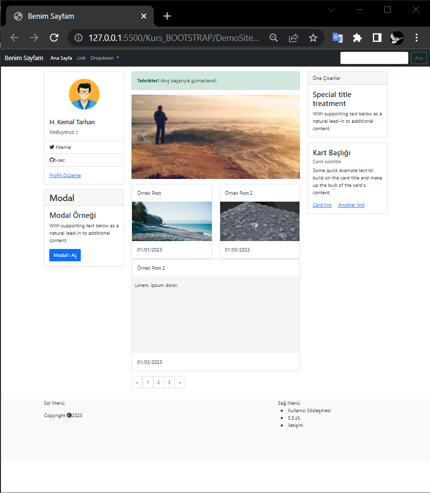

<h1>Bootstrap Dersi Demo Sayfası Çalışması</h1>
<h2>Kullanılan Kaynaklar</h2>
<ul>
    <li><a href="https://app.patika.dev/courses/bootstrap/bootstrap-kullanarak-web-sitesi-nasil-yapilir-demo">Patika.Dev</a></li>
    <li><a href="https://getbootstrap.com/">Bootstrap 5.0</a></li>
    <li><a href="https://hackerthemes.com">Hacker Themes</a></li>
    <li><a href="https://fontawesome.com/">Font Awesome</a></li>
    <li><a href="https://startbootstrap.com/">Bootstrap Themes</a></li>  
</ul>
